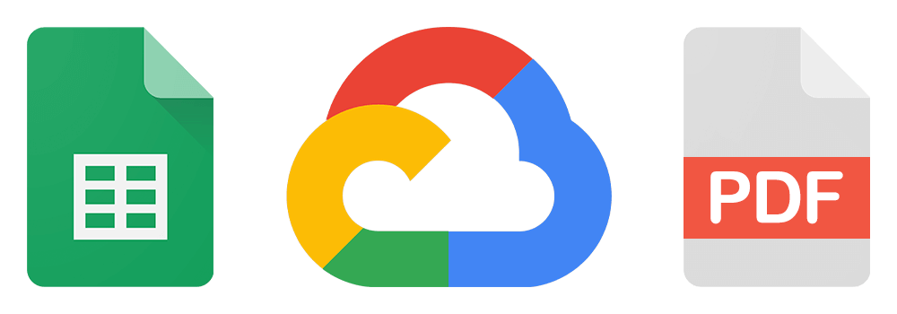
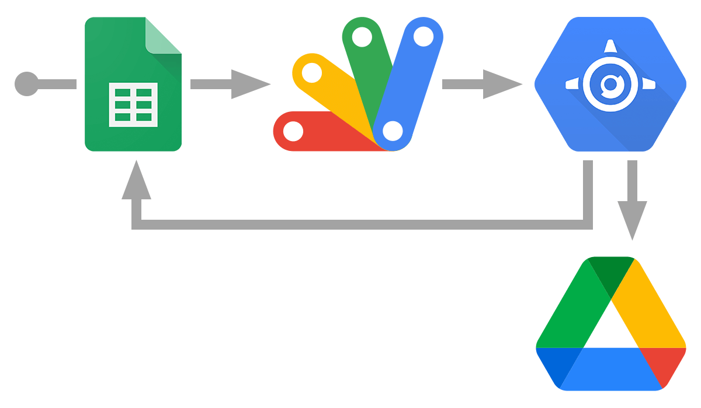

<h1 align="center">Cloud Invoicing</h1>

  
   
  <i>NodeJS project to create German invoices from a Google Sheets document. Deployable to Google App Engine and automatable using Apps Script.</i>

    See the <a href="examples/"><strong>invoice examples</strong></a>, and start your own <a href="https://docs.google.com/spreadsheets/d/1JRJ3KQetNAAPzsJat-JH7iIzc3OGumWQyFL5MZfm5UU/copy"><strong>accounting spreadsheet</strong></a>.

## Features

- Track customers, products and orders in a spreadsheet
- Verify order data and generate invoice dates and numbers
- Export invoices in PDF format (only in German language)
- Include VAT notices for Kleinunternehmer or reverse-charge procedures

### Integrations

- Upload invoices to Google Drive
- Run in Google Cloud Platform for a fully automated solution

### What is not implemented

- VAT calculation
- Invoice translations
- Other invoice formats

> :warning: **Disclaimer: _I am not a tax advisor, and as stated in the [license](LICENSE), I am by no means responsible for the use of this software._** _Please note that this was built for my own needs and may not fit your use case._

---

## Requirements

You will need Node.js and Yarn installed in your environment.

### Node

- #### Node installation on Windows

  Go to the [official Node.js website](https://nodejs.org/) and download the installer.
  Be sure to have `git` available in your PATH, `npm` might need it (you can find git [here](https://git-scm.com/)).

- #### Node installation on Ubuntu

  Install nodejs and npm with apt install, just run the following commands:

      $ sudo apt install nodejs
      $ sudo apt install npm

- #### Other Operating Systems
  You can find more information about the installation on the [official Node.js website](https://nodejs.org/) and the [official NPM website](https://npmjs.org/).

If the installation was successful, you should be able to run the following commands:

    $ node --version
    v16.14.0

    $ npm --version
    8.3.1

### Yarn

After installing node you will also need to install yarn:

      $ npm install -g yarn

## Prepare the project folder

Download the project and install its dependencies:

    $ git clone https://github.com/joanroig/cloud-invoicing
    $ cd cloud-invoicing
    $ yarn install

## Configuration

Create a `.env` file in the root directory based on the provided `.env.example`, then you will need to:

- Create a Google Cloud project and a service account as explained in [this guide](https://theoephraim.github.io/node-google-spreadsheet/#/getting-started/authentication).
- Put the `private_key` and `client_email` values from the JSON of the service account you obtained in the previous step in the `.env` file.
- [Do a copy](https://docs.google.com/spreadsheets/d/1JRJ3KQetNAAPzsJat-JH7iIzc3OGumWQyFL5MZfm5UU/copy) of the provided Google Sheets template.
- Share the spreadsheet with the email of your service account (this allows the service account to access your spreadsheet). To do this, go to your copy of the template and press the share button, then enter the service account email and send the invitation.
- Put the spreadsheet ID from the URL of your Google Sheets document into the `spreadsheet_id` of the `.env` file, the ID should look similar to this: `1JRJ3KQetNAAPzsJat-JH7iIzc3OGumWQyFL5MZfm5UU`

### Automatic upload to Drive

- Create a folder in Drive and share the folder with the email of your service account.
- Put the folder ID from the URL of your Drive folder into the `drive_folder_id` of the `.env` file.

_Note: You can disable the upload of invoices by setting the property `upload-to-drive` to `false` in `config/default.json`._

## Running the project manually

Add some data in the spreadsheet and activate the checkboxes of the `Run` column in the `Orders` tab for each invoice you want to generate.

Then, run the following command and check the console output and the out folder for checking your results:

    $ yarn start:once

## Run the production server locally

The project can run as a server to execute the invoice generation on demand. You can test it locally by executing the following commands, and then access http://localhost:8080 in your browser every time you want to trigger the generation:

    $ yarn build
    $ yarn start

# Google Cloud Platform (GCP) integration

After verifying locally that everything works, you may want to automate it in the cloud.

> :warning: **Heads up: This may take a lot of time and troubleshooting if you are not experienced with GCP.**

> :warning: **In my experience, running this app on GCP does not exceed the free quotas. Please note that you need to enable billing, and I am not responsible for any costs involved.**

## Introduction

We need to have a Google Cloud project to upload the server to App Engine, then create an Apps Script, secure the communication between Apps Script and App Engine, and finally trigger the invoice generation from the spreadsheet.

### GCP architecture overview

To provide a better understanding of all actors, the process flow looks like this:

1. The user uses `Google Sheets` to trigger `Apps Script`
2. `Apps Script` sends an HTTP GET request to `App Engine` which verifies the user via `IAP`
3. `App Engine` starts the invoice generation, which uses a `Service Account` to:
   1. Read, verify and update `Google Sheets` data
   2. Upload invoices to `Google Drive`

 

  
   
  <i>Simplified GCP architecture diagram</i>

 

### APIs overview

Following the guide will require to enable multiple Google Cloud APIs. You will be asked to enable them when needed via CLI or via the Google Cloud website:

- Cloud Logging API
- Cloud Build API
- Google Sheets API
- Google Drive API
- Cloud Identity-Aware Proxy API

Extra APIs used to prevent unwanted billings:

- Cloud Billing API
- Cloud Pub/Sub API
- Cloud Functions API

## Google App Engine setup

The App Engine is where the production server will be deployed and where the invoices will be generated. It will be your own secure cloud environment by protecting the access with IAP (Identity-Aware Proxy).

- [Enable billing](https://console.cloud.google.com/billing) for your Google Cloud project.
- _Optional: configure a Cloud Function to prevent unwanted billings by following the [official documentation](https://cloud.google.com/billing/docs/how-to/notify) or this [video](https://www.youtube.com/watch?v=KiTg8RPpGG4)_.
- [Install the Google Cloud CLI](https://cloud.google.com/sdk/docs/install-sdk), run `gcloud init` in the project root folder and connect it to your project.
- Update the `project_id` of the `.env` file with the Project ID of your Google Cloud project (get it [here](https://console.cloud.google.com/home/dashboard)).
- Run the command `yarn gcloud:deploy` in the root directory to upload the nodejs project. The build folder will be built and then deployed, if you execute the command `gcloud app deploy` remember to build the project before.
- [Enable IAP](https://console.cloud.google.com/security/iap) for the project (toggle the button for your App Engine app), select "All Web Services" and add the Gmail you would like to use to access the Google Sheets document by pressing the "Add Principal" button. Assign the role `IAP-secured Web App User`. Repeat this step for every IAP-allowed user you need.

Now try to access the server URL (shown in the [App Engine Dashboard](https://console.cloud.google.com/appengine), it ends with `.appspot.com`), login with the Gmail used in the previous step, and you should be able to access the deployed server.

The invoice generation will be triggered every time an IAP-allowed user does an HTTP GET request to the server URL. In the next steps, you will configure the trigger from Google Sheets.

## Apps Script setup

An Apps Script of a Google Sheets document acts like a plugin that extends its functionality.

For the purpose of this project, the script will be responsible for sending requests to the App Engine server on behalf of an allowed user, which is needed to go through IAP.

- Open your spreadsheet, in the menu open `Extensions > Apps Script`
- Go to the configuration of the Apps Script, toggle the `Show "appsscript.json" manifest file in editor` checkbox.
- Also in the configuration, assign the Project Number of the Google Cloud project (get it [here](https://console.cloud.google.com/home/dashboard)).
- Copy the `appsscript.json` and the `Code.gs` file from the examples/Apps Script folder in the Apps Script files.
- Edit the `Code.gs` file to add your own credentials:
  - Go to [credentials](https://console.cloud.google.com/apis/credentials) and create a new OAuth 2.0 Client ID of type `Web application`. Use the Client ID and Client Secret for the values of `CLIENT_ID` and `CLIENT_SECRET` respectively.
  - Use the Client ID of the `IAP-App-Engine-app` (find it in [credentials](https://console.cloud.google.com/apis/credentials) under the OAuth 2.0 Client IDs) for the value of `IAP_CLIENT_ID`.
  - The `IAP_URL` is the server URL that ends with `.appspot.com`.

## Running in the cloud

Now you should be able to find a menu called `Generate Invoices` in your spreadsheet (refresh the page if not). Click the `Run now` option and the invoices will appear in your Drive folder.

### Debugging

Something is not working? Then check the latest run logs on Google App Engine by running the following command:

    $ yarn run gcloud:logs

Remember that you can always redeploy by running:

    $ yarn run gcloud:deploy

## Credits

_All trademarks, logos and brand names are the property of their respective owners._

PDF template based on: https://gist.github.com/maxkostinevich/c26bfb09450341ad37c1bd6c2cc51bb2

Logger based on: https://gist.github.com/euikook/d72a40b3864856af57a6dcbec9d97007
