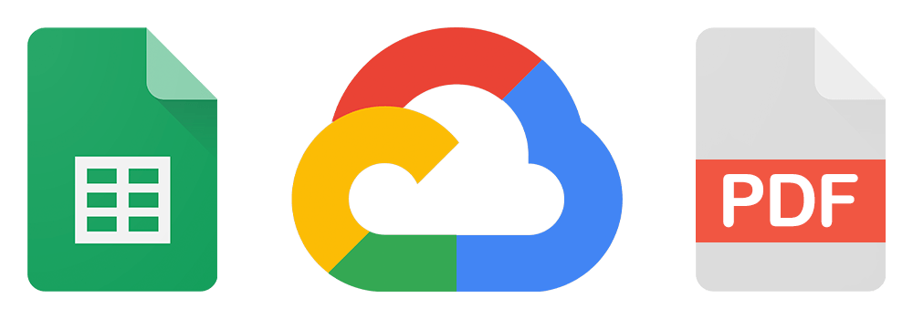

<h1 align="center">Cloud Invoicing</h1>

  
   
  <i>NodeJS project to create German invoices from a Google Sheets document. Deployable to Google App Engine and automatable using Apps Script.</i>
   
  

  See the <a href="examples/"><strong>invoice examples</strong></a> and start your own <a href="https://docs.google.com/spreadsheets/d/1JRJ3KQetNAAPzsJat-JH7iIzc3OGumWQyFL5MZfm5UU/copy"><strong>accounting sheet</strong></a>
   

<!-- See the [invoice examples](examples/) and start your own [accounting](https://docs.google.com/spreadsheets/d/1JRJ3KQetNAAPzsJat-JH7iIzc3OGumWQyFL5MZfm5UU/copy) sheet. -->

## Features

- Track customers, products and orders
- Generate and manage invoice data
- Automatic generation of invoice date and invoice number
- Export invoices in pdf format (only in German language)
- Small business owner and reverse-charge VAT notices

### Integrations

- Upload invoices to Google Drive
- Run as a server on Google Cloud Platform for a fully automated solution

### What is not implemented

- VAT calculation
- Translations
- Multiple invoice formats

> Disclaimer: _This project may not be useful if you have different needs or if you already have another kind of accounting system. I am not a tax advisor, and as stated in the [license](LICENSE), I am by no means responsible for the use of this software._

---

## Requirements

You will only need Node.js and a node global package, Yarn, installed in your environment.

### Node

- #### Node installation on Windows

  Go to the [official Node.js website](https://nodejs.org/) and download the installer.
  Be sure to have `git` available in your PATH, `npm` might need it (you can find git [here](https://git-scm.com/)).

- #### Node installation on Ubuntu

  Install nodejs and npm with apt install, just run the following commands:

      $ sudo apt install nodejs
      $ sudo apt install npm

- #### Other Operating Systems
  You can find more information about the installation on the [official Node.js website](https://nodejs.org/) and the [official NPM website](https://npmjs.org/).

If the installation was successful, you should be able to run the following commands:

    $ node --version
    v16.14.0

    $ npm --version
    8.3.1

###

### Yarn installation

After installing node and npm you will also need to install yarn:

      $ npm install -g yarn

## Prepare the project folder

Download the project and install its dependencies:

    $ git clone https://github.com/joanroig/cloud-invoicing
    $ cd cloud-invoicing
    $ yarn install

## Configuration

Create a `.env` file in the root directory based on the provided `.env.example`, then edit it with your settings. You will need to:

- Create a service account, get one by following [this guide](https://theoephraim.github.io/node-google-spreadsheet/#/getting-started/authentication?id=service-account).
- Put the `private_key` and `client_email` values from the JSON you obtained in the previous step in the `.env` file, respectively.
- [Do a copy](https://docs.google.com/spreadsheets/d/1JRJ3KQetNAAPzsJat-JH7iIzc3OGumWQyFL5MZfm5UU/copy) of the provided Google Sheets template.
- Share the sheet with the email of your service account (this allows the service account to access your sheet). To do this, go to your copy of the template and press the share button, then enter the service account email and send the invitation.
- Put the Sheet ID from the URL of your sheet into the `sheet_id` of the `.env` file, the ID should look similar to this: `1JRJ3KQetNAAPzsJat-JH7iIzc3OGumWQyFL5MZfm5UU`

### Automatic upload to Drive

_Note: You can disable the upload of invoices by setting the property `upload-to-drive` to `false` in `config/default.json`._

To configure it:

- Create a folder in Drive and share the folder with the email of your service account.
- Put the folder ID from the URL of your Drive folder into the `folder_id` of the `.env` file.

## Running the project manually

Add some data in the sheet and activate the checkboxes of the `Run` column in the `Orders` tab for each invoice you want to generate.

Then, run the following command and check the console output and the out folder for checking your results:

    $ yarn start:once

## Run the production server locally

The project can run as a server to execute the invoice generation on demand. You can test it locally by executing the following commands, and then accessing http://localhost:8080 in your browser every time you want to trigger the generation:

    $ yarn build
    $ yarn start

# Google Cloud Platform integration

After verifying that everything works locally, you may want to automate the PDF generation in the cloud.

> :warning: **Heads up: This may take a lot of time and troubleshooting if you are not experienced with the Google Cloud Platform.**

We need to create a Google Cloud project, upload the code to App Engine, create an Apps Script and secure the communication between Apps Script and App Engine to finally trigger the invoice generator from the accounting sheet.

To provide a better understanding of all actors, the process flow looks like this:

1. `Google Sheet` triggers `Apps Script`
2. `Apps Script` sends an HTTP GET request to `App Engine` and does authenticate via `IAP`
3. `App Engine` runs the `Invoice Generator`
4. The `Invoice Generator` uses a `Service Account` to:
   - Read `Google Sheet` and check all data
   - Update `Google Sheet`
   - Upload invoices to `Google Drive`

Following the guide will require to enable multiple Google Cloud APIs. You will be asked to enable them when needed via CLI or via the Google Cloud website:

- Cloud Logging API
- Cloud Build API
- Google Sheets API
- Google Drive API
- Cloud Identity-Aware Proxy API

Extra APIs used to prevent unwanted billings:

- Cloud Billing API
- Cloud Pub/Sub API
- Cloud Functions API

## Google App Engine setup

- [Create a Google Cloud project](https://console.cloud.google.com/cloud-resource-manager) and [enable billing](https://console.cloud.google.com/billing) for it.
- _Optional: configure a Cloud Function to prevent unwanted billings with the [official documentation](https://cloud.google.com/billing/docs/how-to/notify) or with [this video](https://www.youtube.com/watch?v=KiTg8RPpGG4)_.
- [Install the Google Cloud CLI](https://cloud.google.com/sdk/docs/install-sdk), run `gcloud init` in the project root folder and connect it to your project.
- Change the `gcloud:deploy` script in [package.json](./package.json) to point the Project ID of your Google Cloud project (get it [here](https://console.cloud.google.com/home/dashboard)), for example: `--project cloud-invoicing`
- Run the command `yarn gcloud:deploy` in the root directory to upload the nodejs project. The build folder will be built and then deployed, if you execute the command `gcloud app deploy` remember to build the project before.
- [Enable IAP](https://console.cloud.google.com/security/iap) for the project (toggle the button for your App Engine app), select "All Web Services" and add the Gmail you would like to use to access the Google Sheets document by pressing the "Add Principal" button. Assign the role `IAP-secured Web App User`. Repeat this step for every IAP-allowed user you need.

Now try to go to the url that appears in the IAP (shown in the Published column, it ends with `.appspot.com`), login with the Gmail used in the previous step, and you should be able to access the deployed server.

The invoice generation will be triggered every time an IAP-allowed user does a GET request to the url. In the next steps, you will configure the trigger from Google Sheets.

## Apps Script setup

- Open your accounting sheet, in the menu open `Extensions > Apps Script`
- Go to the configuration of the Apps Script, toggle the `Show "appsscript.json" manifest file in editor` checkbox.
- Also in the configuration, assign the Project Number of the Google Cloud project (get it [here](https://console.cloud.google.com/home/dashboard)).
- Copy the `appsscript.json` and the `Code.gs` file from the examples/Apps Script folder in the Apps Script files.
- Edit the Code.gs file to add your own credentials:
  - Go to [credentials](https://console.cloud.google.com/apis/credentials) and create a new OAuth 2.0 Client ID of type `Web application`. Use the Client ID and Client Secret for the next for the `CLIENT_ID` and `CLIENT_SECRET`.
  - The `IAP_CLIENT_ID` can be found in the [credentials](https://console.cloud.google.com/apis/credentials), it is named `IAP-App-Engine-app`. You just need to copy the Client ID.
  - The `IAP_URL` is the URL that ends with `.appspot.com`.

## Running in the cloud

Now you should be able to open your accounting sheet and find a menu called `Generate Invoices`, click the `Run now` option and the invoices should appear in your Drive folder.

### Debugging

Check the latest run logs on Google App Engine by running the following command:

    $ yarn run gcloud:logs

Remember that you can always redeploy by running:

    $ yarn run gcloud:deploy

## Credits

PDF template based on: https://gist.github.com/maxkostinevich/c26bfb09450341ad37c1bd6c2cc51bb2

Logger based on: https://gist.github.com/euikook/d72a40b3864856af57a6dcbec9d97007
